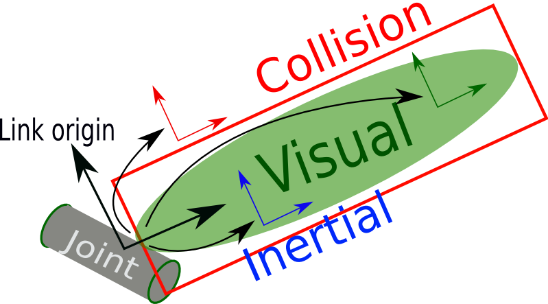
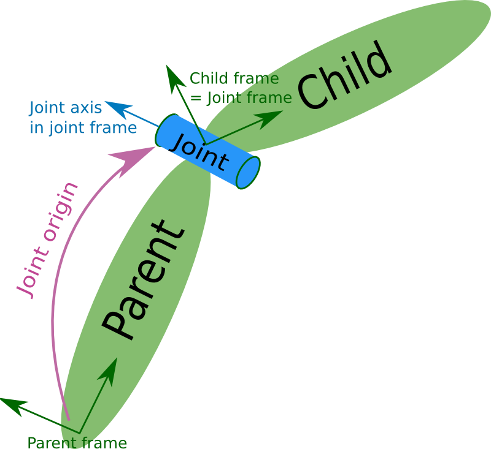

---
metadata-files:
  - _variables.yml
title: Clase  - Taller de resolución
format:
    html:
        code-fold: true
        code-summary: "Show the code"
        # code-copy: false
        # code-overflow: wrap
        code-line-numbers: false
        code-annotations: hover
        toc: true
        anchor-sections: false
        number-sections: true
        number-depth: 2
bread-crumbs: true
page-navigation: true
---

# URDF y `xacro`

## URDF

### Etiqueta `<robot>..<\robot>`

- Etiqueta raíz (todo el contenido se encuentra dentro)

```{.xml}
<?xml version="1.0"?>

<robot name="[nombre]">
    <!-- ..  -->
    <!-- Descripción del robot -->
    <!-- ..  -->
</robot>
```

### Etiqueta `<link> .. </link>`

- 1 solo atributo: el nombre
- 3 posibles geometrías: `<visual>`, `<collision>` y `<inertial>`

```xml
<link name="[nombre]_link">
    <visual> <!-- ..  --> </visual>
    <collision> <!-- ..  --> </collision>
    <inertial> <!-- ..  --> </inertial>	
</link>
```

{fig-align="center" width="75%"}

#### Etiqueta `<visual> .. </visual>`

- Origen:
```xml {code-line-numbers="false"}
    <origin xyz="[pos_x] [pos_y] [pos_z]" rpy="[roll] [pitch] [yaw]"/>
```

- Material:
```xml {code-line-numbers="false"}
    <material name="[nombre]">
        <color rgba="[R] [G] [B] [Alpha]"/>
    </material>
```

- Geometría: `<geometry> .. </geometry>`
  - Prisma: 
```xml {code-line-numbers="false"}
    <box size="[largo-x] [ancho-y] [alto-z]" />
```
  - Cilindro:
```xml {code-line-numbers="false"}
    <cylinder radius="[radio]" length="[ancho]" />
```
  - Esfera:
```xml {code-line-numbers="false"}
    <sphere radius="[radio]" />
```
  - Malla:
```xml {code-line-numbers="false"}
    <mesh filename="file:///[nombre_del_archivo]" />
```

#### Etiqueta `<collision> .. </collision>`
- Origen:
```xml {code-line-numbers="false"}
    <origin xyz="[pos_x] [pos_y] [pos_z]" rpy="[roll] [pitch] [yaw]"/>
```

- Geometría: `box`, `cylinder`, `sphere`, `mesh`

### Etiqueta `<joint> .. </joint>`

{fig-align="center" width="75%"}

- 2 atributos: el nombre y tipo
- 2 elementos requeridos: *link* padre e hijo
- Tipos:
  - Fija (`fixed`)
```xml {code-line-numbers="false"}
<joint name="[nombre]_joint" type="fixed">
    <parent link="[padre_link]"/>
    <child link="[hijo_link]"/>
    <origin xyz="[pos_x] [pos_y] [pos_z]"
            rpy="[roll] [pitch] [yaw]"/>
</joint>
```
  - Continua (`continuous`)
```xml {code-line-numbers="false"}
<joint name="[nombre]_joint" type="continuous">
    <parent link="[padre_link]"/>
    <child link="[hijo_link]"/>
    <origin xyz="[pos_x] [pos_y] [pos_z]"
            rpy="[roll] [pitch] [yaw]"/>
    <axis xyz="[x] [y] [z]"/>
</joint>
```
  - Revolución (`revolute`)
```xml {code-line-numbers="false"}
<joint name="[nombre]_joint" type="revolute">
    <parent link="[padre_link]"/>
    <child link="[hijo_link]"/>
    <origin xyz="[pos_x] [pos_y] [pos_z]"
            rpy="[roll] [pitch] [yaw]"/>
    <axis xyz="[x] [y] [z]"/>
    <limit lower="[min_rad]" upper="[max_rad]"
           velocity="[rad_por_seg]"
           effort="[effort]" />
</joint>
```

## *XACRO*

- Agregar al tag `robot` del *URDF* `xmlns:xacro="http://www.ros.org/wiki/xacro"`:

```xml {code-line-numbers="false"}
<robot name="mi_robot" xmlns:xacro="http://www.ros.org/wiki/xacro" >
    <!-- ..  -->
    <!-- Descripción del robot -->
    <!-- ..  -->
</robot>
```

### Inclusión de archivos


::: {.callout-note appearance="simple"}

- **Archivo principal**: extensión '`.urdf.xacro`' y contiene el tag `robot` [con nombre]{.underline}
- **Archivos a incluir**: extensión '`.xacro`' y solo contienen el tag `robot`

:::


- Para incluir:
```xml {code-line-numbers="false"}
    <xacro:include filename="[ruta_del_archivo]" />
```

### Parametrización de atributos

- Propiedades `xacro:property`: Nombre y valor

```xml {code-line-numbers="false"}
    <xacro:property name="[nombre]" value="[valor]" />
```

- Operaciones matemáticas y acceso a variables: `${..}` 
```xml {code-line-numbers="false"}
    <!-- ..  -->
    <cylinder radius="${diametro/2}" length="${ancho}" />
    <!-- ..  -->
```

- Argumentos `xacro:args`: Nombre y valor por defecto
```xml {code-line-numbers="false"}
    <xacro:arg name="[nombre_argumento]" default="[valor_defecto]"/>
```
::: {.callout-note appearance="minimal"}
Luego podemos ejecutar el comando *XACRO* con el valor del argumento `nombre_argumento:=[valor]`
:::

- Buscar paquetes `$(find ..)`:
```xml {code-line-numbers="false"}
    <xacro:include filename="$(find [nombre_paquete])/[ruta_del_archivo]" />
```

### Bloques condicionales
- Etiqueta `xacro:if` para `true` y `xacro:unless` para `false`
```xml {code-line-numbers="false"}
<xacro:if value="[expresion]">
    <!-- Si la expresión es verdadera: 'true' o 1 -->
</xacro:if>
<xacro:unless value="[expresion]">
    <!-- Si la expresión es falsa: 'false' o 0  -->
</xacro:unless>
```

### Macros

- Definir *macro* `xacro:macro`: Nombre y parámetros a recibir
```xml {code-line-numbers="false"}
<xacro:macro name="[nombre_macro]" params="[param1] [param2]:=[valor_defecto]">
    <!-- Codigo del macro: ejemplo con parámetros -->
    <link name="${param1}">
        <visual>
            <geometry>
                <sphere radius="${param2}" />
            </geometry>
        </visual>
    </link>
</xacro:macro>
```

- Aplicar o ejecutar *macro* `xacro:[nombre_macro]` y los parámetros definidos:
```xml {code-line-numbers="false"}
<xacro:nombre_macro param1="[valor_param1]" param2="[valor_param2]" /> 
```

- Si ejecutamos el *macro* con los valores `rueda` y `1.0`, la salida será:
```xml {code-line-numbers="false"}
...
    <link name="rueda">
        <visual>
            <geometry>
                <sphere radius="1.0" />
            </geometry>
        </visual>
    </link>
...
```

### Compilación del URDF

- Desde consola

        $ xacro [ubicacion_del_archivo/nombre_archivo.xacro.urdf]

- Desde *launch*
  - Importar las librerías
```python
from launch.substitutions import Command, PathJoinSubstitution
from launch_ros.substitutions import FindPackageShare
```
  - Ubicar el archivo y procesarlo
```python
    # Ubicación del paquete y del archivo URDF
    urdf_path = PathJoinSubstitution(
        [FindPackageShare("[nombre_paquete]"),  "urdf", "[nombre_archivo].urdf.xacro"]
    )
    
    # Procesar archivo URDF
    urdf = Command(['xacro ', urdf_path])
```


## Adaptación del paquete

- Se agrega la carpeta `urdf` para los archivos de descripción

```default {filename="Estructura robot_description" code-line-numbers="false"}
📂 robot_description
├── 📁 robot_description
├── 📁 launch
├── 📂 urdf
│   ├── 📄 robot.urdf.xacro
│   ├── 📄 materials.xacro
│   ├── 📄 mi_macro.xacro
│   ├── 📄 sim_sensor.xacro
│   └── ...
├── 📦 package.xml
├── ⚙️ setup.cfg
├── 🛠️ setup.py
│   
```

- Configuración de `setup.py`

```{.py filename="setup.py" code-fold="true" code-line-numbers="true"}
  # ... Otros parámetros
  data_files=[
    # ... Otros archivos
    # Incluir todos los archivos de la carpeta launch
    (os.path.join('share', package_name, 'launch'), glob('launch/*'))
    # Incluir todos los archivos de la carpeta urdf
    (os.path.join('share', package_name, 'urdf'), glob('urdf/*'))
    # Incluir todos los archivos de la carpeta meshes
    (os.path.join('share', package_name, 'meshes'), glob('meshes/*'))
  ],
```

# *Robot state publisher* y *joint publishers*

## `robot_state_publisher`

- Ejecutar desde consola
```
    $ ros2 run robot_state_publisher robot_state_publisher
                --ros-args -p robot_description:='<robot_description>'
```

- Cargar desde *launch*
```python
    Node(
        package = 'robot_state_publisher',
        executable = 'robot_state_publisher',
        parameters=[{
            'robot_description': '<robot_description>',
        }]
    )
```

## `joint_state_publisher_gui`

- Ejecutar desde consola
```
    $ ros2 run joint_state_publisher_gui joint_state_publisher_gui
```

- Cargar desde *launch*:
```python
    Node(
        package = 'joint_state_publisher_gui',
        executable = 'joint_state_publisher_gui',
        output = 'screen',
    )
```

# Resolución ejercicios 1 y 2



