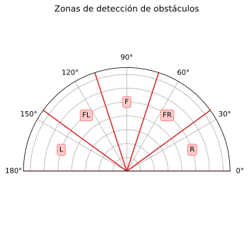

---
metadata-files:
  - _variables.yml
title: Clase  - Laboratorio
format:
    html:
        code-fold: true
        code-summary: "Show the code"
        # code-copy: false
        # code-overflow: wrap
        code-line-numbers: false
        code-annotations: hover
        notebook-links: false
        toc: true
        anchor-sections: false
        number-sections: true
        number-depth: 2
bread-crumbs: true
page-navigation: true
---

# Simulación de sensores con *Gazebo* (Parte II)

## Sensor de tipo LiDAR

- #### Descripción del sensor

```{.xml code-line-numbers="false"}
<gazebo reference="{nombre_link}">
    <sensor name="{nombre_sensor}" type="gpu_lidar">
        <update_rate>{freq_hz}</update_rate>
        <topic>{nombre_topic}</topic>
        <always_on>true</always_on>
        <visualize>true</visualize>

        <lidar>
        <scan>
        <horizontal>
            <samples>{cantidad_rayos}</samples>
            <resolution>1</resolution>
            <min_angle>{min}</min_angle>
            <max_angle>{max}</max_angle>
        </horizontal>
        <vertical>
            <!-- Mismos parámetros que 'horizontal' -->
        </vertical>
        </scan>
        <range>
            <min>{rango_min}</min>
            <max>{rango_max}</max>
            <resolution>{res_lineal}</resolution>
        </range>
        </lidar>
    </sensor>
</gazebo>
```

- #### Modelo de ruido gaussiano

```{.xml code-line-numbers="false"}
<noise>
    <type>gaussian</type>
    <!-- Media -->
    <mean>{media}</mean>
    <!-- Desviación estándar -->      
    <stddev>{desviacion_estandar}</stddev>
</noise>
```

- #### Parámetros de ejemplo

>   - Rango de distancia: 0.05 - 15.0 [m]
>   - Frecuencia de escaneo: 10 [Hz]
>   - Resolución angular: 0.1125°
>   - Presición: ± 30 [mm]
>   - Resolución: 10 [mm]


```{.xml code-line-numbers="true"}
<sensor name="lidar" type="gpu_lidar">
    <always_on>true</always_on>
    <update_rate>10</update_rate>
    <topic>/scan</topic>
    <visualize>true</visualize>

    <lidar>
        <scan>
        <horizontal>
            <samples>3200</samples>
            <resolution>1</resolution>
            <min_angle>${-pi}</min_angle>
            <max_angle>${pi}</max_angle>
        </horizontal>
        <!-- Al ser 2D no tiene parámetros verticales -->
        </scan>
        <range>
            <min>0.05</min>
            <max>15</max>
            <resolution>0.010</resolution>
        </range>
        <noise>
            <type>gaussian</type>
            <mean>0.0</mean>
            <stddev>0.030</stddev>
        </noise>
    </lidar>
</sensor>
```


## Detector de obstáculos con LiDAR

- #### 1. Modificar el `URDF` del robot para implementar un LiDAR simulado

- #### 2. Crear un nodo que a partir de los datos del sensor detecte obstáculos dentro de 5 zonas particulares

::: {.callout-note appearance="simple" title="Puede mostrar la distancia mínima para cada zona o si supera cierto umbral enviar un mensaje indicando que zona/s"}
:::

{width="70%" fig-align="center"}
