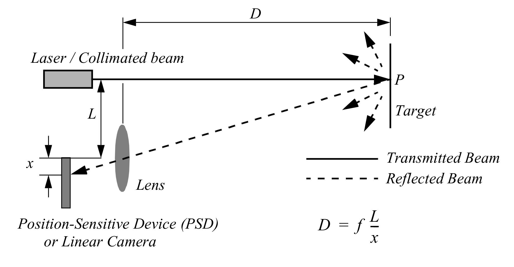

---
metadata-files:
  - _variables.yml
pagetitle: "Clase "
title: "Robótica"
subtitle: "Clase "
date: today
date-format: "[Semana  - ]"
institute: "FICH - UNL"
format:
  revealjs:
        theme: default
        footer: <a href="/">Robótica 2026 - Tecnicatura Universitaria en Automatización y Robótica </a>
        menu: false
        slide-number: c
        history: false
        code-overflow: wrap
        code-copy: false
        fig-format: svg
        include-in-header:
            text: |
                <meta name="viewport" content="width=device-width, initial-scale=1.0">
                <style>.mjx-chtml{ font-size: 100% !important; }</style>
output-file: index.html
jupyter: python3
---

# Percepción {visibility="hidden"}

## Percepción: Repaso {.smaller}

- #### Clasificaciones principales:

> Propioceptivos y [Exteroceptivos]{.underline}
  
> Pasivos y Activos


# Exteroceptivos {visibility="hidden"}

## Exteroceptivos {.smaller}

>[Exteroceptivos]{.underline}: Adquieren información del entorno del robot <!--que se procesan para extraer características ambientales significativas -->

- Medida de distancia
- Intensidad de la luz
- Amplitud de sonido


## Sensores de rango activo {.smaller}

> Sensores capaces de medir directamente la distancia a un objeto en la vecindad del robot

- [Activos]{.underline}: emiten algún tipo de energía en forma de señal y miden la señal de respuesta del entorno
- Costos proporcionales a la precisión, resolución, al rango y aplicación 
- Múltiples principios de funcionamientos (con sus respectivas características)

- 2 principios más usados: **ToF** y **Triangulación**

## Time of Flight (ToF) {.smaller}

> Principio de funcionamiento basado en la velocidad del sonido o una onda electromagnética (luz)

$$
d = \frac{c \cdot t}{2}
$$

donde $c$ es la velocidad de la onda, $t$ es el tiempo de vuelo (ToF) y $d$ la distancia (generalmente se mide el recorrido completo, ida y vuelta)

- Ejemplo con una distancia de 1.5 metros:
    - Velocidad del sonido: $c \approx 343 [\mathrm{m/s}]$ $\to$ $t = 0.0087 [\mathrm{s}]$
    - Velocidad de la luz: $c \approx 299792 [\mathrm{m/ms}]$ $\to$ $t = 0.00001 [\mathrm{ms}] = 0.00000001 [\mathrm{s}]$


## Time of Flight (ToF) {.smaller}

La calidad de estos sensores depende principalmente de:

- Errores de medición del $t$ y el tiempo exacto de arribo de la señal reflejada
- Dispersión del haz
- Interacción con el medio (absorción, reflejos, "contaminación")
- Variaciones o valor exacto de la velocidad de propagación (afectado por temperatura, humedad, etc)
- La velocidad relativa en objetivos dinámicos o en movimiento


## Sensor de ultrasonido ToF {.smaller}

::: {.columns}
::: {.column}

> Transmite un "paquete" de ondas de presión ultrasónicas y mide el tiempo que tardan en reflejarse y volver.

- Generalmente en robótica móvil se utilizan en rangos de 5 a 200 [cm]
- Cuanto más cerrado es el ángulo de apertura del haz mejor resolución direccional
- Principal limitación: se obtiene la profundidad de una región constante (1D)

:::
::: {.column}

{width="45%" fig-align="center"}

{width="90%" fig-align="center"}

:::
:::


## Sensor láser ToF {.smaller}

> Emisor que ilumina el objetivo con un láser y un receptor capaz de detectar la componente de luz reflejada alineada al haz emitido

- Mejora respecto del sensor de ultrasonido al utilizar un haz de luz (pero genera problema con objetos translúcidos)
- Formas de medir el ToF para ondas electromagnéticas:
    - Emisión de un pulso y medir el tiempo que transcurre en volver (picosegundos)
    - Emitir una onda modulada y medir el cambio de fase (desfase)

## Sensor láser ToF {.smaller}

::: {.columns}
::: {.column}

**TFmini** sensor de distancia 1D

{width="80%" fig-align="center"}

:::
::: {.column}

**VL53L7CX** sensor de distancia 2D (8x8)

{width="75%" fig-align="center"}

:::
:::

## Triangulación {.smaller}

> Principio de funcionamiento basado en geometría y el ángulo de reflexión


::: {.columns}
::: {.column width="45%"}

- Buena exactitud con alta precisión a un bajo costo
- Gran ancho de banda y no sufre interferencia como el ultrasonido
- Rango limitado por la geometría del sensor

:::
::: {.column width="55%"}

{width="100%" fig-align="center"}

:::
:::


## Triangulación óptica 1D {.smaller}

**GP2Y0A02YK0F** (20-150cm) y **GP2Y0A60SZLF** (10-150cm)

{width="80%" fig-align="center"}


## Light Detection and Ranging - LiDAR {.smaller}

::: {.columns}
::: {.column}

> Medir la distancia al objeto más próximo en un radio de 360° sobre un plano con gran precisión angular y lineal

- Utilizan triangulación (mayoría) o ToF
- Extensión a 3D mediante mecanismos mecánicos y/u ópticos

:::
::: {.column}

Slamtec **RPLiDAR A3M1** (2D)

{width="100%" fig-align="center"}

:::
:::

## Características de los LiDAR {.smaller}

- [Rango]{.underline}: Distancia mínima y máxima (entre $\times 10^{-2}$ y $\times 10^{2}$ metros)
- [Velocidad de rotación]{.underline}: 5, 10, 15 [Hz] (r.p.s)
- [Resolución]{.underline}: angular y lineal
<!-- - [Linealidad]{.underline}:  -->
<!-- - [Ancho de banda]{.underline}: -->
<!-- - [Error]{.underline}: -->
- [Otros parámetros]{.underline}: Protocolo de comunicación (UART, Ethernet, etc)
- [Problemas asociados]{.underline}: Apto o no para ambientes exteriores. Corriente de consumo.


## Sistema global de navegación por satélite (GNSS) {.smaller visibility="hidden"}

::: {.columns}
::: {.column}

- Información relativa a la ubicación, velocidad y sincronización horaria
- Posición absoluta con precisión de 1.5 a 2 metros
- Baja frecuencia de actualización
- Sistemas RTK con mejor precisión y frecuencia (a mayor costo)
- Problemas de recepción de señal

:::
::: {.column}

{width="100%" fig-align="center"}

:::
:::


# Simulación de sensores {visibility="hidden"} 

## Simulación de sensores: *LiDAR* {.smaller}

::: {.columns}
::: {.column}

> Parámetros

- Tipo: `gpu_lidar`
- Plugin: `gz::sim::systems::Sensors`
- Iniciar encendido (`always_on`)
- Frecuencia de datos en [Hz]
- Topic (de tipo `gz.msgs.LaserScan`)

:::
::: {.column}

<br>

```{.xml code-line-numbers="1-6,10-11"}
<gazebo reference="lidar_link">
  <sensor name="lidar" type="gpu_lidar">
    <always_on>true</always_on>
    <update_rate>{freq_hz}</update_rate>
    <topic>{nombre_topic}</topic>
    <visualize>true</visualize>

      <!-- .. -->
  
  </sensor>
</gazebo>
```

:::
:::

## Sensor tipo LiDAR {.smaller}

::: {.columns}
::: {.column}

> Parámetros

- Parámetros angulares (`scan`):
  - Cantidad de rayos
  - Resolución (angular)
  - Apertura (ángulo min. y max en °)
  - Para un *LiDAR* 3D el valor de samples en `vertical` debe ser $\mathrm{> 1}$
- Parámetros lineales (`range`):
  - Distancia máxima y mínima a detectar
  - Resolución lineal
- Parámetros de ruido *gaussiano*

:::
::: {.column}

<br>

```{.xml code-line-numbers="8-30|11|12|13,14|16-18|20-24|25-29"}
<gazebo reference="lidar_link">
  <sensor name="lidar" type="gpu_lidar">
    <always_on>true</always_on>
    <update_rate>{freq_hz}</update_rate>
    <topic>{nombre_topic}</topic>
    <visualize>true</visualize>

    <lidar>
      <scan>
        <horizontal>
          <samples>{cantidad_rayos}</samples>
          <resolution>{res}</resolution>
          <min_angle>{min}</min_angle>
          <max_angle>{max}</max_angle>
        </horizontal>
        <vertical>
          <!-- Mismos parámetros -->
        </vertical>
      </scan>
      <range>
        <min>{rango_min}</min>
        <max>{rango_max}</max>
        <resolution>{res_lineal}</resolution>
      </range>
      <noise>
        <type>gaussian</type>
        <mean>{media}</mean>
        <stddev>{dev_std}</stddev>
      </noise>
    </lidar>
  </sensor>
</gazebo>
```

:::
:::

## Ejemplo 2D: *Slamtec S3M1-R2* {.smaller}

::: {.columns}
::: {.column}

- #### Measurement Performance
  - `Distance Range`: $0.05 - 15.0 \mathrm{[m]}$
  - `Scanning Frequency`: Typ. $10 \mathrm{[Hz]}$
  - `Angular Resolution`: Typ. $0.1125 ^{\circ}$
  - `Accuracy`: $\pm 30 \mathrm{[mm]}$
  - `Resolution`: $10 \mathrm{[mm]}$

:::
::: {.column}

[{fig-align="center" fig-env="figure*"} ](https://www.robotshop.com/products/slamtec-rplidar-s3-360-laser-scanner-40-m){target=_blank}

:::
:::

::: {.aside}
[Datasheet S3 (slamtec.com)](https://bucket-download.slamtec.com/f9435aaf1a6563d781120f799cd63f7b0413c5bc/SLAMTEC_rplidar_datasheet_S3_v1.1_en.pdf){target="_blank"}
:::

## Definición de los parámetros {.smaller}

> Ejemplo *S3M1-R2*

```{.xml code-line-numbers="|2-5|9-14|15|17-21|22-26"}
<sensor name="lidar" type="gpu_lidar">
    <always_on>true</always_on>
    <update_rate>10</update_rate>
    <topic>/scan</topic>
    <visualize>true</visualize>

    <lidar>
      <scan>
        <horizontal>
          <samples>3200</samples>     <!-- 360/0.1125 -->
          <resolution>1</resolution>
          <min_angle>${-pi}</min_angle>
          <max_angle>${pi}</max_angle>
        </horizontal>
        <!-- Al ser 2D no tiene parámetros verticales -->
      </scan>
      <range>
        <min>0.05</min>                 <!-- 5 cm -->
        <max>15</max>                   <!-- 15 m -->
        <resolution>0.010</resolution>  <!-- 10 mm -->
      </range>
      <noise>
        <type>gaussian</type>
        <mean>0.0</mean>
        <stddev>0.030</stddev>          <!-- 30 mm -->
      </noise>
    </lidar>
  </sensor>
```

## Topics de *Gazebo* {.smaller}

> Los datos de los sensores se publican dentro de *Gazebo*

- Actualizar el archivo de configuración del `ros_gz_bridge`

::: {}
<!-- Bloque intencional -->
:::

::: {.columns}
::: {.column width="10%"}
:::
::: {.column width="80%"}

```yaml {filename="gz_bridge.yaml" code-line-numbers="false"}
- topic_name: "<nombre_topic>"
  ros_type_name: "sensor_msgs/msg/LaserScan"
  gz_type_name: "gz.msgs.LaserScan"
  direction: GZ_TO_ROS
  lazy: true
```

:::
::: {.column width=10%"}
:::
:::


## Mensajes de LIDAR {.smaller}

- *Gazebo*: `gz.msgs.LaserScan`
- *ROS2*: `sensor_msgs/msg/LaserScan`

```{.default code-line-numbers="false"}
sensor_msgs/LaserScan
├── std_msgs/Header header
├── float32 angle_min           # Angulo incial [rad]
├── float32 angle_max           # Angulo final [rad]
├── float32 angle_increment     # Distancia angular entre mediciones [rad]
|
├── float32 time_increment      # Tiempo entre mediciones [seconds]
├── float32 scan_time           # Tiempo entre scans [seconds]
|
├── float32 range_min           # Rango mínimo [m]
├── float32 range_max           # Rango máximo [m]
|
├── float32[] ranges            # Valores de rango medidos [m]
└── float32[] intensities       # Intensidades de luminosidad medidas
```

::: {.aside}
[Definición del mensaje (docs.ros.org)](https://docs.ros.org/en/latest/api/sensor_msgs/html/msg/LaserScan.html){target="_blank"}
:::

# Laboratorio {visibility="hidden"}

## [Laboratorio](lab.qmd) {.center}

Simulación de sensores en *Gazebo*
