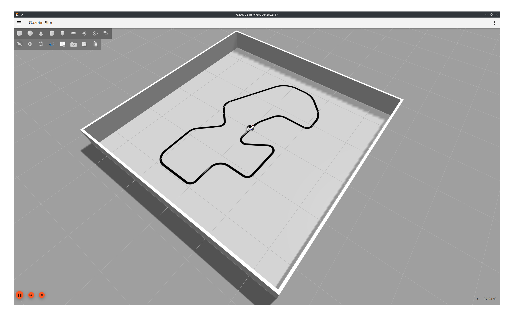
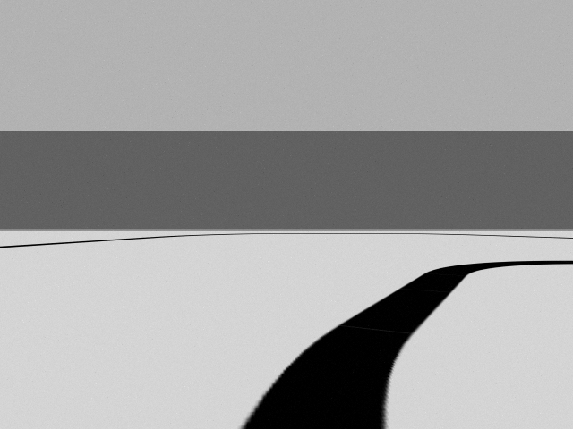
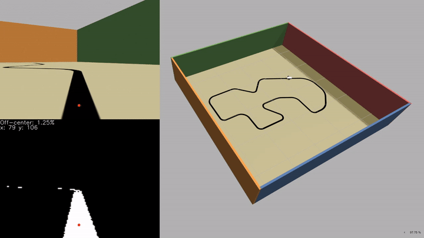

---
metadata-files:
  - _variables.yml
pagetitle: "Clase "
title: "Robótica"
subtitle: "Clase "
date: today
date-format: "[Semana  - ]"
institute: "FICH - UNL"
format:
  revealjs:
        theme: default
        footer: <a href="/">Robótica 2026 - Tecnicatura Universitaria en Automatización y Robótica </a>
        menu: false
        slide-number: c
        history: false
        code-overflow: wrap
        code-copy: false
        fig-format: svg
        include-in-header:
            text: |
                <meta name="viewport" content="width=device-width, initial-scale=1.0">
                
output-file: index.html
---

# Line follower {visibility="hidden"}

## Simulación de sensores (parte III) {.smaller}

> #### Caso práctico: Seguidor de línea 

- Simular una cámara en Gazebo y obtener video desde ROS2
- Utilizar procesamiento de imágenes para detectar el camino
- Controlar el robot para seguir la pista

::: {.columns}
::: {.column}

{width="100%" fig-align="center" style="filter: drop-shadow(0px 0px 0.5rem hsla(0deg, 0%, 0%, 0.5));"}
:::
::: {.column}

<!-- [Desde la cámara]{.underline}: -->

{width="70%" fig-align="center" style="filter: drop-shadow(0px 0px 0.5rem hsla(0deg, 0%, 0%, 0.5));"}

Point-of-View

:::
:::

# Simulación de cámara {visibility="hidden"}



# Procesamiento con `cv2` {visibility="hidden"}



# Control de la velocidad angular {visibility="hidden"}



# Demo {visibility="hidden"}

## Demo

# Ajustes de la simulación {visibility="hidden"}



# Laboratorio {visibility="hidden"}

## [Laboratorio](lab.qmd) {.center}

Seguidor de lineas
